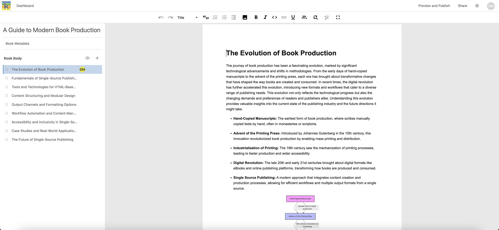
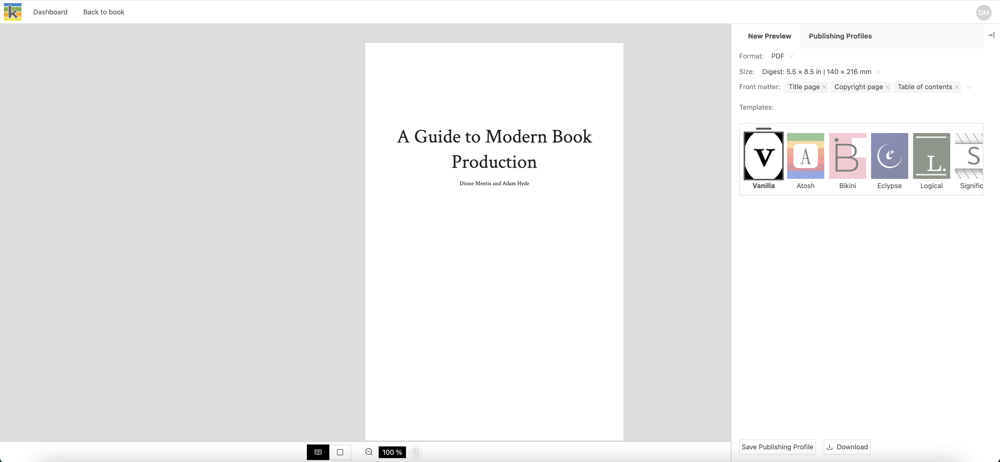
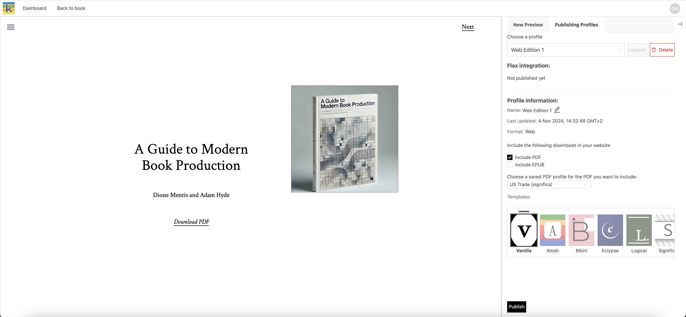
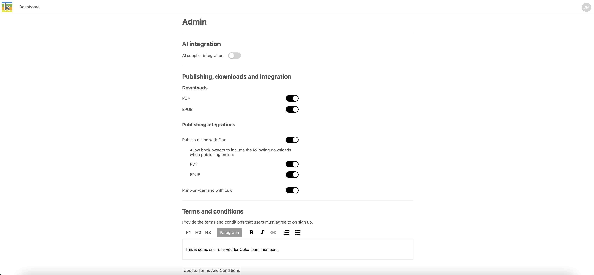

## Overview

Ketty organises your book production workflow through four main interfaces. Each interface serves specific purposes in your publishing journey.

## The Dashboard (aka Your Books)

The Dashboard is your starting point and home base in Ketty.

### What you'll see

- An alphabetical list of your books
- Books shared with you by others
- The "New Book" button
- Book cover thumbnails

### What you can do

- Create new books
- Access your existing books
- Delete books you own
- Access the **Book Metadata** page to manage book covers and metadata
- Navigate to books shared with you

## The Producer interface

The Producer is your main workspace for creating and managing book content.

### Navigation elements

- Top bar: Links to the **Dashboard**, **Preview and Publish**, **Share**, and **Settings** pages
- User menu: Your initials for account options
- Left sidebar: Book structure, chapter management, and access **Book Metadata** page
- Main area: Content editor

### Key features

- Book title and metadata access
- Chapter list and management
- Content editing tools
- Real-time saving
- Collaboration indicators

### Content management

- Add new chapters
- Upload Word documents
- Convert chapters to parts
- Organise your book structure

## The Preview and Publish interface

Preview helps you review your book's appearance and prepare for publication. Saving a preview creates a publishing profile that can be exported, connected to a print-on-demand supplier, or publsihed online.  

### Main functions

- View PDF and web previews
- Select page sizes for PDF format
- Choose design templates
- Manage front matter
- Save publishing profiles
- Access export, print-on-demand, and online publishing options

### View controls

- Toggle single/double page view
- Adjust zoom levels
- Navigate through pages
- Show/hide the right sidebar

## The Admin interface

The Admin interface is available to users with admin privileges.

### Admin capabilities

- Configure instance settings
- Manage integrations
- Set terms and conditions
- Control platform features

## Interface tips

### Navigation

- Use the top bar for moving between interfaces
- Look for your initials to access account options
- Watch for collaboration indicators next to part and chapter titles

### Best practices

- Don't worry about saving your work regularly (auto-save is enabled)
- Check previews frequently
- Log out when finished
- Keep one chapter open at a time

### Getting help

- Look for tooltips on interface elements
- Check the documentation for detailed guidance
- Contact your administrator for access issues

